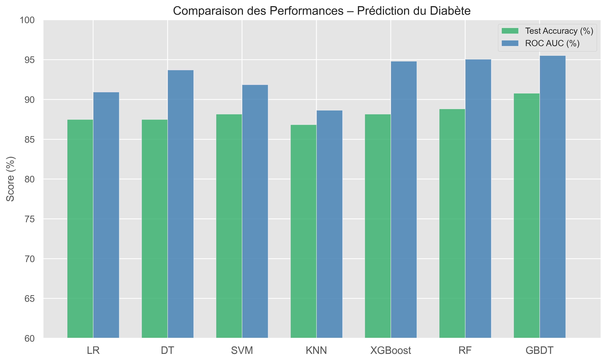
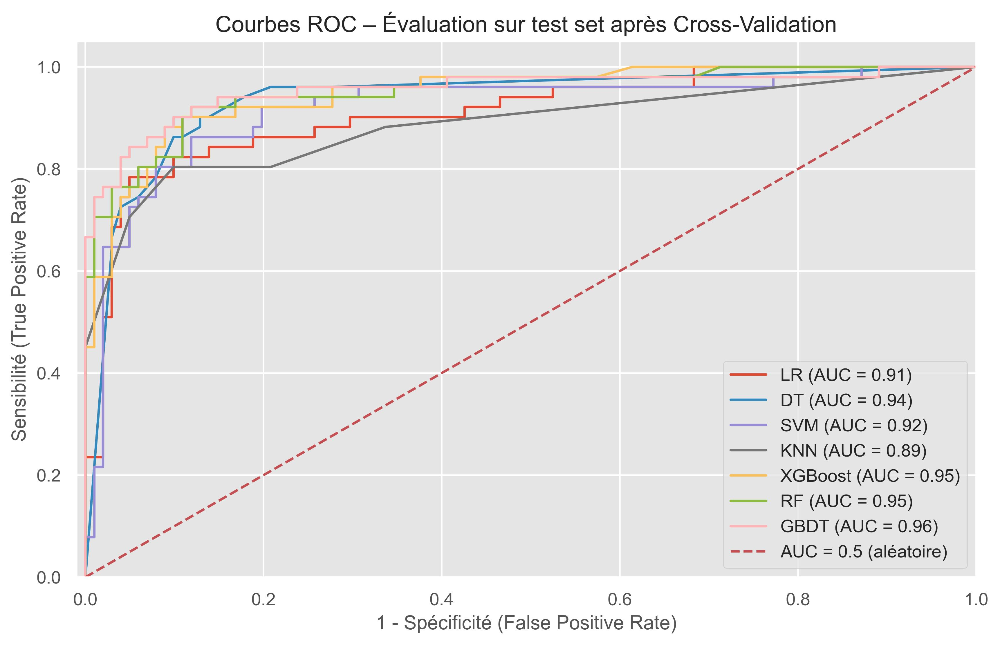

# Diabetes Prediction App

Application de prédiction du diabète avec Streamlit, modèle GBDT entraîné, visualisations, CSV, multilingue et recommandations personnalisées.

---

## Objectifs du projet

Cette application a été conçue pour :

- Prédire le **risque de diabète** à partir de données médicales simples
- Proposer une **interface claire et intuitive**, accessible à tous
- Fournir des **recommandations personnalisées** selon les résultats
- Permettre une utilisation **individuelle ou en lot (CSV)**
- Comparer les performances de différents modèles de Machine Learning

---

## Technologies utilisées

- **Langage** : Python 3.10+  
- **Interface** : Streamlit  
- **ML** : Scikit-learn (GradientBoostingClassifier)  
- **Visualisation** : Seaborn, Matplotlib  
- **Utilitaires** : Pandas, NumPy, Joblib, dotenv  
- **Multilingue** : Français 🇫🇷 / English 🇬🇧  

---

## Structure du projet

```
diabetes_app/
├── app.py                          # Application principale Streamlit
├── models/
│   ├── gb_diabetes_model.pkl       # Modèle ML (GBDT)
│   └── scaler.pkl                  # Scaler utilisé
├── utils/
│   └── predict.py                  # Fonction de prédiction
├── data/
│   └── diabetes.csv                # Dataset d'entraînement
├── assets/
│   ├── PE_diabetes.jpeg            # Comparaison modèles (barplot)
│   └── roc_diabetes.jpeg           # Courbes ROC
├── .env                            # Fichier de configuration sécurisé
├── requirements.txt                # Dépendances Python
└── README.md                       # Ce fichier
```

---

## Fonctionnalités principales

### Prédiction individuelle
- Formulaire interactif avec contrôles de saisie
- Ajustement du **seuil de prédiction**
- Affichage de la **probabilité estimée**
- Recommandations médicales dynamiques

### Prédiction par fichier CSV
- Import d’un fichier contenant plusieurs patients
- Prédiction en masse avec seuil ajustable
- Téléchargement d’un fichier enrichi avec résultats

### Analyse du modèle
- Comparaison des modèles (GBDT, RF, XGBoost...)
- Affichage de l'**Accuracy** et de l'**AUC**
- **Courbes ROC** + barplot de performance

### Authentification utilisateur
- Connexion via login/mot de passe stockés en `.env`

### Interface multilingue
- Choix entre **Français** et **English**

---

## Comparaison des performances

### Performance des modèles (Accuracy & AUC)


> Le modèle GBDT surpasse les autres en **ROC AUC** (96 %) et **précision** (>91 %).

### Courbes ROC


> Le modèle GBDT montre une excellente séparation des classes (AUC = 0.96). Random Forest et XGBoost suivent de près.

---

## Installation locale

```bash
git clone https://github.com/votre-utilisateur/diabetes_app.git
cd diabetes_app
python -m venv .venv
source .venv/bin/activate  
pip install -r requirements.txt
streamlit run app.py
```

---

## Prérequis

- Python ≥ 3.10
- Streamlit ≥ 1.35

---

## Dataset utilisé

- [Pima Indians Diabetes Database (Kaggle)](https://www.kaggle.com/datasets/uciml/pima-indians-diabetes-database)


## Améliorations futures

- Génération PDF de rapport patient
- Historique de session patient
- Intégration d’un second modèle (XGBoost, ensemble...)
- Sécurisation avancée via `st.secrets` ou base utilisateurs

